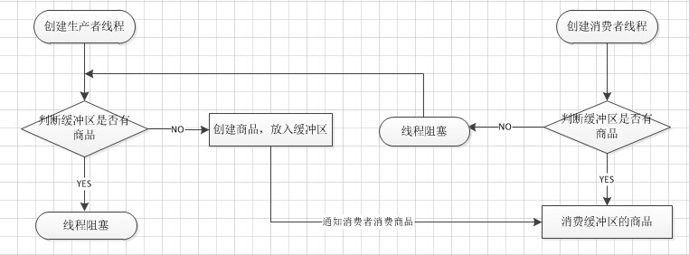

# 生产者/消费者模式

> 生产者消费者模式并不是GOF提出的23种设计模式之一，23种设计模式都是建立在面向对象的基础之上的，但其实面向过程的编程中也有很多高效的编程模式，生产者消费者模式便是其中之一，它是我们编程过程中最常用的一种设计模式。
生产者消费者模式是为了解决哪一类问题而产生的呢？在实际的软件开发过程中，经常会碰到如下场景：某个模块负责产生数据，这些数据由另一个模块来负责处理（此处的模块是广义的，可以是类、函数、线程、进程等）。产生数据的模块，就形象地称为生产者；而处理数据的模块，就称为消费者。单单抽象出生产者和消费者，还够不上是生产者／消费者模式。该模式还需要有一个缓冲区处于生产者和消费者之间，作为一个中介。生产者把数据放入缓冲区，而消费者从缓冲区取出数据。

#### 生产者消费者的关系如下图所示：

#### 生产者消费者模式的原理描述：
1. 生产者仅仅在仓储未满时候生产，仓满则停止生产。
2. 消费者仅仅在仓储有产品时候才能消费，仓空则等待。
3. 当消费者发现仓储没产品可消费时候会通知生产者生产。
4. 生产者在生产出可消费产品时候，应该通知等待的消费者去消费。